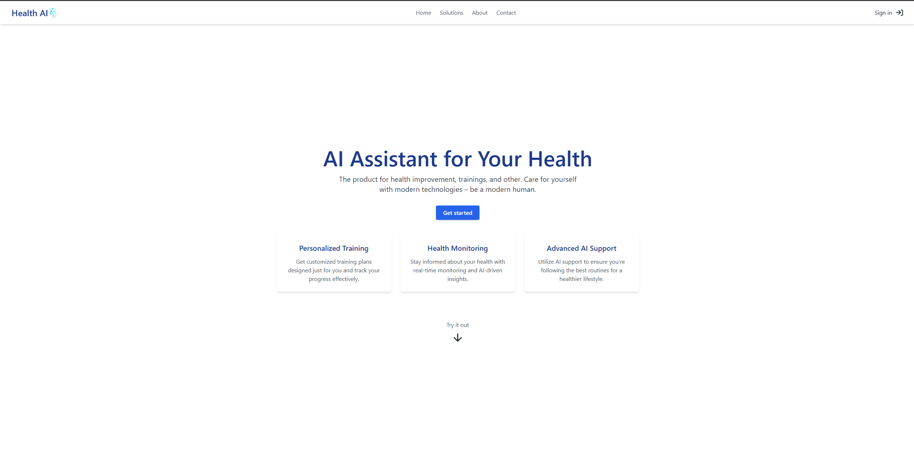
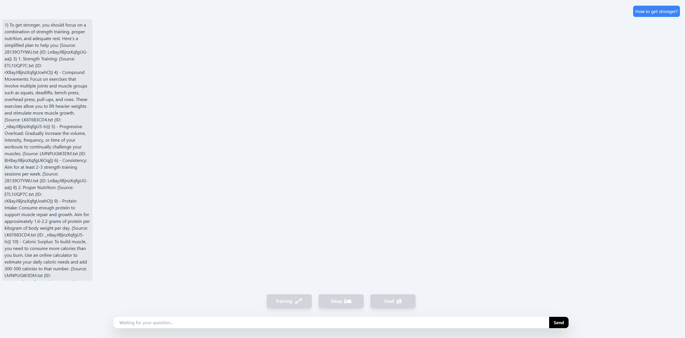

# Health Assistant Chatbot Project
This is a full-stack health assistant chatbot project built using TypeScript, React and Tailwind for the frontend; Flask with Flask-CORS, Sentence Transformers for the backend.
## Table of Contents
- [Features](#features)
- [Technologies Used](#technologies-used)
- [Installation](#installation)
- [Backend Setup](#backend-setup)
- [Frontend Setup](#frontend-setup)
- [Usage](#usage)
- [Screenshots](#screenshots)
- [License](#license)
## Features
- **Advanced NLP Processing:** Uses Mistral API for natural language understanding.
- **Search and Indexing:** Elasticsearch-based search functionality.
## Technologies Used
### Frontend
- **TypeScript**
- **React**
- **Tailwind**
### Backend
- **Flask**
- **Flask-CORS**
- **Sentence Transformers**
- **Elasticsearch**
- **Mistral API**
## Installation
### Prerequisites
- NPMs installed
- Python and pip installed
- Elasticsearch deployed and accessible
- API keys for Mistral API and Elasticsearch
### Backend Setup
1. **Clone the repository:**
    ```bash
    git clone
    ```
2. **Navigate to the backend folder:**
    ```bash
    cd backend
    ```
3. **Install Python dependencies:**
    ```bash
    pip install flask_cors
    pip install sentence_transformers
    # Install any other missing library as needed with `pip install <library_name>`
    ```
4. **Set up environment variables:**
   In the root of the project, create a `.env` file with the following environment variables:
    ```env
    ELASTIC_CLOUD_ID="XYZ"
    ELASTIC_USERNAME="XYZ"
    ELASTIC_PASSWORD="your_password"
    ELASTIC_INDEX_NAME="text_documents"
    MISTRAL_API_KEY="your_mistral_api_key"
    MISTRAL_ENDPOINT_URL="https://api.mistral.ai/v1/chat/completions"
    MISTRAL_MODEL_NAME="mistral-large-latest"
    ```
5. **Run the backend server:**
    ```bash
    python app.py
    ```
### Frontend Setup
1. **Navigate to the frontend folder:**
    ```bash
    cd frontend
    ```
2. **Install frontend dependencies:**
    ```bash
    npm install
    ```
3. **Run the React development server:**
    ```bash
    npm run dev
    ```
## Usage
- Open your browser and go to the localhost address shown in the terminal to view the frontend.
- The backend API will be running on the designated port.
- Users can get a trial version on the landing page as well as use the chat to ask health-related questions and receive personalized recommendations.
## Screenshots


